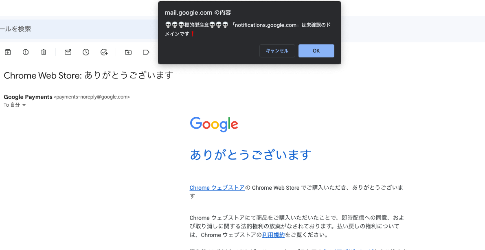
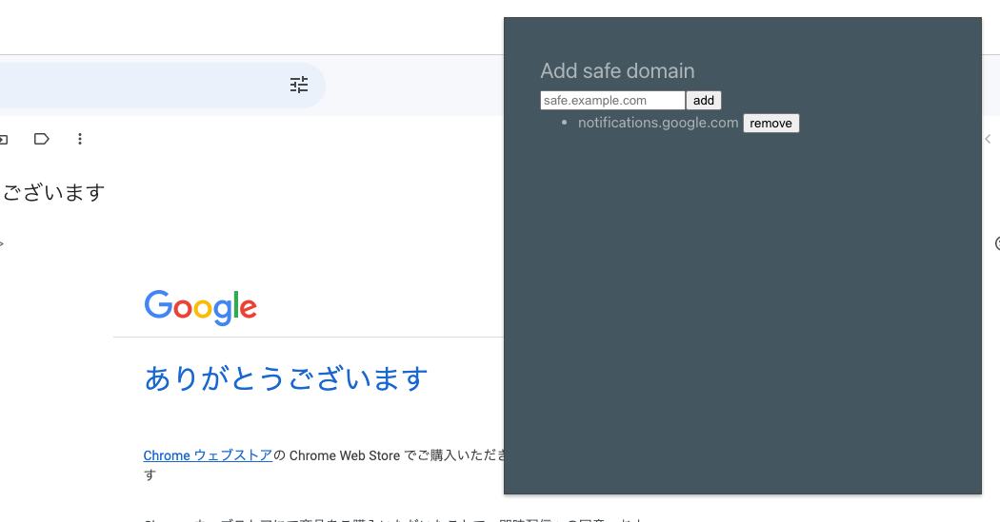

# link-click-checker

## Description

Gmail で未知のドメインのリンクをクリックした際に警告を出す Chrome 拡張。標的型メールやスパムメールなどでうっかりリンクをクリックしてしまった場合にリスク防御できます。

未知のドメインをブロック。


未知ドメインを安全なドメインとして登録すると、警告がされずに画面遷移可能になる。


## How to use

自分で build するか zip ファイルを使うかのどちらかで拡張を使用可能

### from build

1. link-click-checker のビルド

```
npm i
npm run build
```

2. Chrome で「chrome://extensions/」とアドレスバーに入力して遷移
3. 右上のデベロッパーモードのトグルを ON にする
4. 「パッケージ化されていない拡張機能を読み込む」

### from zip

1. repository 直下の dist.zip を解凍
2. Chrome で「chrome://extensions/」とアドレスバーに入力して遷移
3. 右上のデベロッパーモードのトグルを ON にする
4. 「パッケージ化されていない拡張機能を読み込む」
